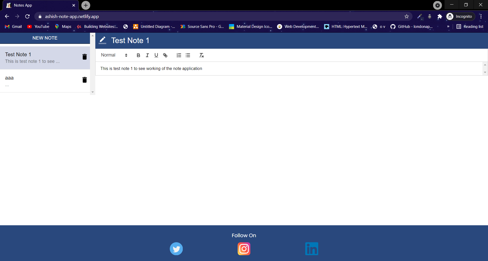

# Notes App
> A simple notes taking application created using React , Firebase 
> [Live Demo](https://ash-moviezz.netlify.app/)

## Table of contents
* [General info](#general-info)
* [Screenshots](#screenshots)
* [Technologies](#technologies)
* [Setup](#setup)
* [Features](#features)
* [Status](#status)

## General info
The project is a simple notes taking application. The application allows user to create , edit , delete a note. Fireabase is used to store the notes. For note taking part ract-quill is used. Firebase is used as a backend. For styling along with pure CSS , material-ui/core and material-ui/core are used.

## Screenshots

Home Page 

 

## Technologies
* React - version 17.0.2
* Firebase - version 8.5.0 
* Material UI - version 16.8.0
* material-ui/core - version 4.11.3
* material-ui/icon - version 4.11.2
* react-quill - version 1.3.5

## Setup

In the project directory, first install all the dependenices run:
## `npm install`

To start the project in the project directory run:
## `npm start`

## Features
List of features ready and TODOs for future development
* Responsive

## Status
Project is : _in progess_
